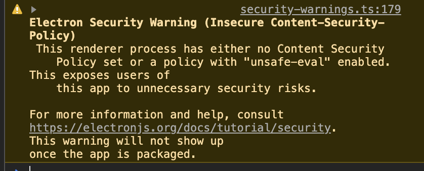

#### 不能使用import{ app } from 'electron'
##### 因为import默认是由webpack处理的,而electron是node服务端内容,  浏览器进程不能调用服务进程的一些接口,  所以通过下列形式引入   
```
const { app } = require('electron')
```
###### 运行时,出现一些警告

```
// 在main.js中添加语句解除警告
process.env.ELECTRON_DISABLE_SECURITY_WARNINGS = true
```